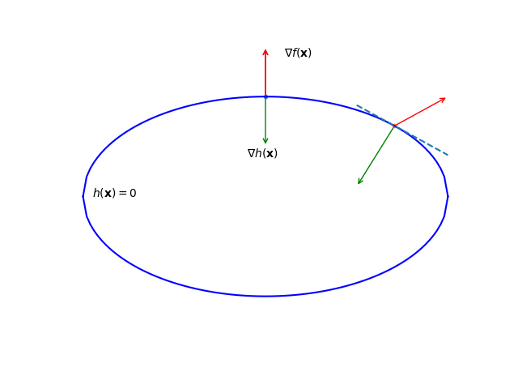
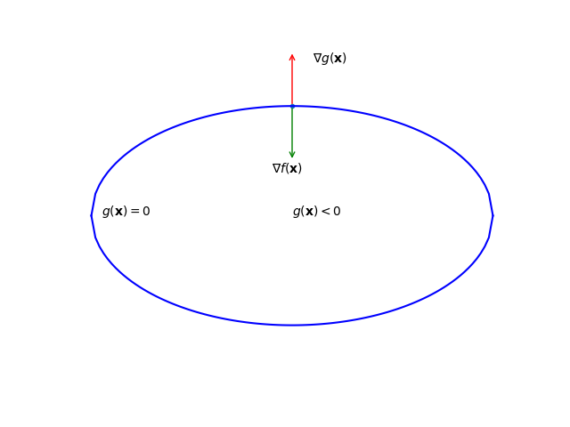

## 等式约束优化

考虑等式约束问题

$$
    \min_{\mathbf{x}} f(\mathbf{x})\quad s.t.\quad h(\mathbf{x})=0
$$

$\mathbf{x}\in \mathbb{R}^d$.
即在$d-1$维的曲面上，使$f(\mathbf{x})$达到最小。

可以看出$h,f$的梯度方向相同或相反时，函数在约束下达到最小（否则必然会有与$\nabla f(\mathbf{x})$ 成钝角的下降方向。）

即，当$f(\mathbf{x})$达到最小时，有
$$
\nabla f(\mathbf{x}) = \lambda\nabla h(\mathbf{x})
$$

等式约束优化即可以化为无约束问题
$$
\min_{\mathbf{x}}L(\mathbf{x},\lambda)
$$
其中$L(\mathbf{x},\lambda)=f(\mathbf{x})+\lambda h(\mathbf{x})$,称为Lagrange函数。

> **$h(\mathbf{x})$的梯度正交与约束曲面$h(\mathbf{x})=0$.**
>
> 以三维为例，
>
> $h(x,y,z)=0$,可写为$z=f(x,y),h(x,y,z) =f(x,y)-z$，**梯度为$(h_x,h_y,-1)$**.
>
> 而曲面在$(x_0,y_0,z_0）$处切平面为：$f_x(x_0,y_0)(x-x_0)+f_y(x_0,y_0)(y-y_0)-(z-z_0)=0$,
>
> 法线方程为:$\frac{x-x_0}{h_x(x_0,y_0,z_0)}=\frac{y-y_0}{h_y(x_0,y_0,z_0)}=\frac{z-z_0}{-1}$.
>
> 可求得法线方向为：
>
> $(x_0,y_0,z_0)-(x_0+1,y_0+\frac{h_y}{h_x},z_0-\frac{1}{h_x})$
>
> =$(1,\frac{h_y}{h_x},-\frac{1}{h_x})$. 
>
> 与梯度方向相同或相反。

## 不等式约束优化
问题可写为
$$
\min_{\mathbf{x}} f(\mathbf{x})\quad s.t.\quad g(\mathbf{x})\leqslant 0
$$
Lagrange函数为$L(\mathbf{x},\lambda)=f(\mathbf{x})+\lambda g(\mathbf{x})$.

如果函数极小点落在$g(\mathbf{x})<0$区域内，此时约束不起作用,即$\lambda=0$.（这种情况自变量维度并没有下降）

如果函数极小点落在边界上，此时$g(\mathbf{x})=0$,类似等式约束。

但此时$\nabla f,\nabla g$方向必然相反，即$\lambda > 0$.
从边界到区域内为$g(\mathbf{x})$会下降，**$\nabla g$必然为外法线方向**，若$\nabla f$与$\nabla g$方向相同，向区域内移动时函数值会下降。

因此，此时约束可以化为
$$
g(\mathbf{x}) \leqslant 0 ;
$$
$$
\lambda \geqslant 0;
$$
$$
\lambda g(\mathbf{x}) = 0
$$
称为KKT条件。

## 对偶问题
考虑m个等式约束，n个不等式约束
$$
\min_{\mathbf{x}} f(\mathbf{x})\quad s.t.{~}h_i(\mathbf{x}) = 0,{~~}g_j(\mathbf{x}) \leqslant 0
$$
$i = 1,2,\cdots,m,j=1,2,\cdots,n$.
Lagrange函数为
$$
L(\mathbf{x},\mathbf{\lambda},\mathbf{\mu})=f(\mathbf{x})+\sum_i^m\lambda_ih_i(\mathbf{x})+\sum_j^n\mu_jg_j(\mathbf{x})
$$
其中Lagrange乘子$\mathbf{\lambda}=(\lambda_1,\cdots,\lambda_m)$,
$\mathbf{\mu}=(\mu_1,\cdots,\mu_n)$.
由不等式约束带来的KKT条件为
$$
g_j(\mathbf{x}) \leqslant 0;
$$
$$
\mu_j\geqslant 0;
$$
$$
\mu_j g_j(\mathbf{x}) = 0
$$

令
$$
\theta_P(\mathbf{x})=\max_{\mathbf{\lambda},\mathbf{\mu}}L(\mathbf{x},\mathbf{\lambda},\mathbf{\mathbf{\mu}})
$$
若某一个约束不满足，如$g_j(\mathbf{x}) > 0$,令$\mu_j\to\infty$,则$\theta_P\to\infty$.

或者如$h_i(\mathbf{x})<0$,则可令$\lambda_i \to -\infty$,使得$\theta_P\to\infty$.
故有
$$
\theta_P({\mathbf{x}}) = f(\mathbf{x})
$$
如果约束条件全都满足.(后面两项小于0，取0时$\theta$最大。)

$$
\theta_P(\mathbf{x}) = \infty
$$
如果约束条件不满足.

原优化问题等价于
$$
\min_{\mathbf{x}} \theta_P(\mathbf{x})=\min_{\mathbf{x}}\max_{\mathbf{\lambda},\mathbf{\mu}}L(\mathbf{x},\mathbf{\lambda},\mathbf{\mu})
$$
又称极小极大问题

**对偶问题**

令
$$
\theta_D=\min_\mathbf{x}L(\mathbf{x},\mathbf{\lambda},\mathbf{\mu})
$$
则有
$$
\theta_D\leqslant L(\mathbf{x},\mathbf{\lambda},\mathbf{\mu})\leqslant f(\mathbf{x})
$$
$\mathbf{x}$为可行域内任意一点。
显然$\theta_D$给出了原问题最优值的下界，最大化这个下界就是原问题的对偶问题。
$$
\max_{\mathbf{\lambda},\mathbf{\mu}} \theta_D(\mathbf{\lambda},\mathbf{\mu})\quad s.t.{~~}\mathbf{\mu} \geqslant 0.
$$

设$d^\star$,$p^\star$,分别为对偶问题和原问题（主问题）的最优值，则有"弱对偶性"
$$
d^\star \leqslant p^\star
$$
等号成立时，称为“强对偶性”

强对偶性一般不成立，但当$f(\mathbf{x}),g_j(\mathbf{x})$均为凸函数，$h_i(\mathbf{x})$为仿射函数，且可行域内至少存在一点使得不等式约束严格成立，则强对偶性成立，主问题就可以转变为对偶问题来优化。
（无论主问题凸性如何，对偶问题总为凸优化问题。）
